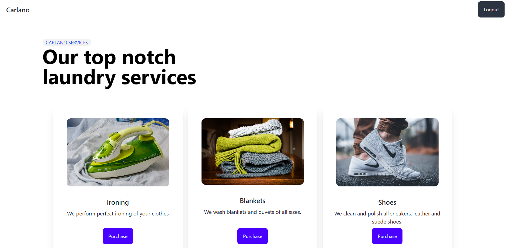

# CARLANO LAUNDRY SERVICE

### `Python`    `Flask` `SQLite`    `HTML/CSS`  `ORM`



## Description

Carlano is a web app written in Python(Flask) and HTML/CSS with SQLite as the database and Flask-SQLAlchemy for ORM. After noticing that the students at my university do not enjoying doing their own laundry, I decided to build this web app so as to provide these services to them(of course not for free).


## How to use the app

- clone this repository
- after opening, you will notice a folder called website and a <strong>main.py</strong> file
- install the below requirements
    ```
    $ py -m pip install flask flask-sqlalchemy flask-login
    ```
- open a terminal and run main.py file
    ```
    $ py main.py
    ```
- the web app's url will be <strong>http://127.0.0.1:5000/home</strong> or <strong>http://127.0.0.1:5000/</strong>
- to make full use of the web app's features and services, one needs to create an account and you are good to go